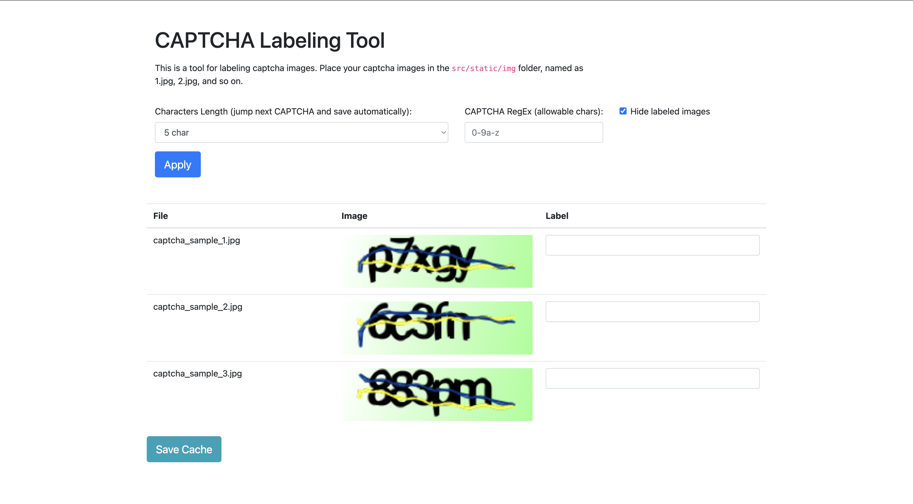

# CAPTCHA Labeling Tool



A Flask-based web application for labeling CAPTCHA images. This tool supports **multiple sites**: each site has its own folder with images and labels. Users select a site, view that site's captchas, and labels are saved per site.

## Features

- **Multi-site support** – Organize captchas by site; each site has its own `img/` and `labels.json`.
- **Site selector** – Choose a site to label only that site's images.
- **Bucket-based distribution** – Multi-user labeling with buckets assigned per session per site.
- **Auto-save** – Labels are saved automatically (with optional manual Save Cache).
- **Auto-Tab** – Optionally jump to the next CAPTCHA after entering a label.
- **Allowable characters** – Restrict input with a regular expression (e.g. `0-9a-z`).
- **Hide labeled images** – Option to hide already-labeled rows.
- **Admin review panel** – Review and mark labels as "Sure" or "Not Sure", with optional site filter.

## Setup

### Installation

1. **Clone the repository:**

    ```bash
    git clone https://github.com/yourusername/captcha-labeling-tool.git
    cd captcha-labeling-tool
    ```

2. **Install dependencies:**

    ```bash
    pip install -r requirements.txt
    ```

3. **Create results folders (one per site):**

   Create a base directory (default: `results/` in the project root). Each **site** is a subfolder containing an `img/` directory and (after labeling) a `labels.json` file. Example:

    ```txt
    results/
    ├── site_a/
    │   └── img/
    │       ├── captcha_1.jpg
    │       └── captcha_2.jpg
    └── site_b/
        └── img/
            └── ...
    ```

   You can override the base directory with the `RESULTS_BASE_DIR` environment variable.

4. **Run the Flask app:**

    ```bash
    cd src
    python app.py
    ```

   The app will be available at `http://127.0.0.1:5000/`.

### Environment variables

| Variable | Default | Description |
|----------|---------|-------------|
| `RESULTS_BASE_DIR` | `../results` (relative to `src/`) | Base directory for site folders. |
| `BUCKET_SIZE` | `20` | Number of images per bucket. |

## Usage

1. Open `http://127.0.0.1:5000/`.
2. **Select a site** from the dropdown. The page loads that site's bucket of images.
3. Enter the label for each CAPTCHA in the input field (or use "Mark as Empty" for unreadable images).
4. Labels auto-save; you can also click **Save Cache** to force save.
5. Use **Request New Bucket** to get another set of images for the same site when the current bucket is done.
6. Optional: **Auto-Tab**, **Allowable Characters**, and **Hide labeled images** in the options area.

### Admin panel

- Open `http://127.0.0.1:5000/admin` to review labeled images.
- Use **Filter by Site** to show one site or "All Sites".
- Mark each label as **Sure** or **Not Sure** and click **Save All Reviews**.

## File structure

### Project layout

```txt
captcha-labeling-tool/
├── LICENSE
├── README.md
├── requirements.txt
├── results/                 # Base dir for sites (configurable)
│   ├── site_a/
│   │   ├── img/             # CAPTCHA images for this site
│   │   ├── labels.json      # Labels for this site
│   │   └── buckets.json     # Bucket state (auto-created)
│   └── site_b/
│       ├── img/
│       └── labels.json
└── src/
    ├── app.py               # Flask app and API
    ├── bucket_manager.py    # Per-site bucket logic
    ├── file_lock.py        # Safe JSON read/write
    ├── sites.py             # Site discovery and paths
    └── templates/
        ├── index.html       # Labeling UI
        └── admin.html       # Admin review UI
```

### Labels format (per site)

Each site's `labels.json` is a flat map of filename to value (or to an object with `value` and optional `admin_review`):

```json
{
  "captcha_1.jpg": "p7xgy",
  "captcha_2.jpg": "6c3fn",
  "captcha_3.jpg": "__NULL__"
}
```

Values are either a string (the label or `"__NULL__"` for empty) or an object like `{"value": "p7xgy", "admin_review": {"status": "sure"}}`.

## Contributing

Contributions are welcome! If you find any issues or have suggestions for improvements, please open an issue or submit a pull request.

## License

This project is licensed under the MIT License. See the `LICENSE` file for details.
